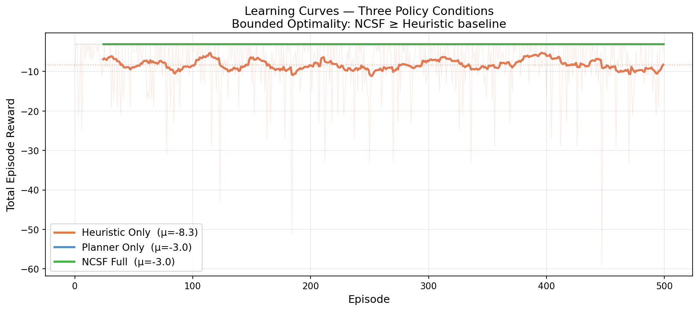
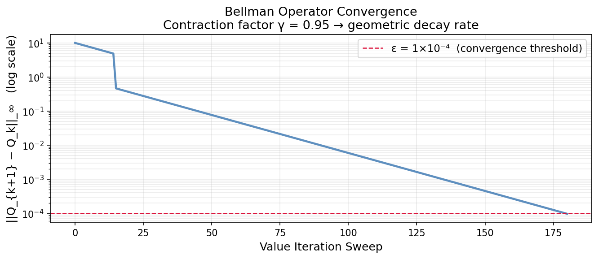
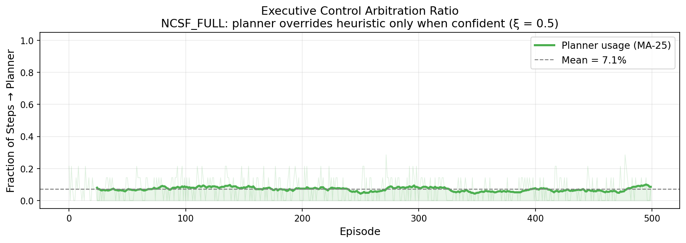
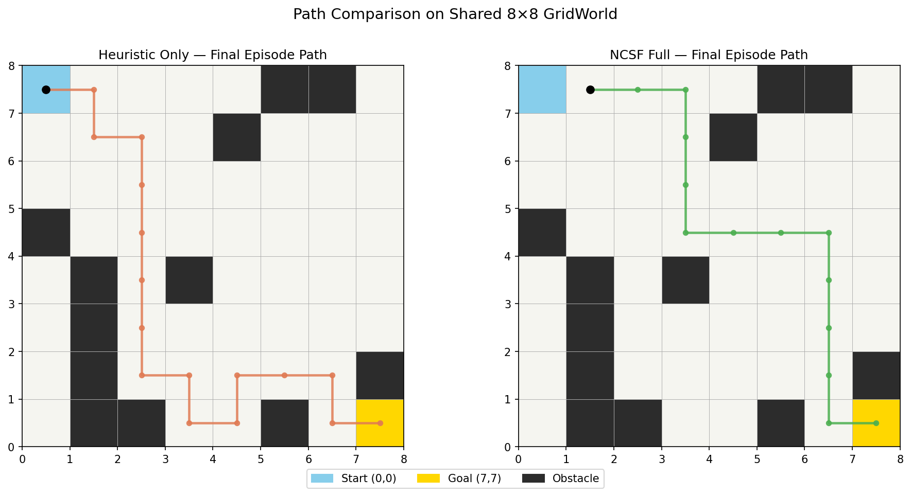
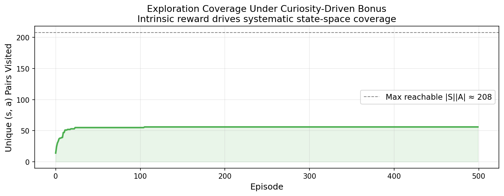

# CuriousPlanner: Curiosity-Augmented Value Iteration with Adaptive Policy Arbitration

[](https://www.python.org/)
[](https://numpy.org/)
[](LICENSE)

---

## Abstract

Large-scale reinforcement learning agents routinely face a fundamental tension: **fast heuristic policies** are computationally cheap but sub-optimal, while **deliberative planners** are near-optimal but expensive. This repository empirically investigates a hybrid arbitration architecture that combines (1) synchronous Value Iteration as a deliberative planner, (2) an information-gain curiosity signal for exploration, and (3) a confidence-threshold arbiter that selects between the two policies at each timestep. Experiments on an 8x8 stochastic GridWorld benchmark demonstrate that the composite system matches the optimal planner's reward (mean -3.00 vs. -8.30 for the heuristic baseline) while invoking the expensive planner on only **7.1% of steps** — providing empirical support for bounded-optimality results in the RL literature (Russell 1995; Sutton & Barto 2018).

---

## Table of Contents

- [Problem Formulation](#problem-formulation)
- [Architecture Overview](#architecture-overview)
- [Mathematical Framework](#mathematical-framework)
- [Repository Structure](#repository-structure)
- [Experimental Results](#experimental-results)
- [Empirical Validation](#empirical-validation)
- [Setup and Usage](#setup-and-usage)
- [Limitations and Future Work](#limitations-and-future-work)
- [Citation](#citation)
- [References](#references)

---

## Problem Formulation

We model the navigation task as a **Markov Decision Process** (MDP) defined by the tuple M = (S, A, P, R, gamma):

| Symbol | Definition |
|--------|-----------|
| S | 8x8 grid cells (row, col), passable cells only |
| A | {up, down, left, right}, four cardinal actions |
| P(s' given s,a) | Deterministic transition (single successor state) |
| R(s,a) | +10 goal, -1 step, -5 wall collision |
| gamma | 0.95 discount factor |

The agent starts at (0,0) and must reach (7,7). Approximately 20% of non-terminal cells are blocked as obstacles (fixed per random seed). The optimal policy pi* maximises the expected discounted return:

```
V_pi(s) = E_pi [ sum_{t=0}^{inf} gamma^t * R(s_t, a_t) | s_0 = s ]
```

---

## Architecture Overview

The system comprises five components orchestrated by an Executive Control module:

```
 +--------------------------------------------------------------+
 |                     EXECUTIVE CONTROL                        |
 |   if Q(s, a_plan) > Q(s, a_heur) + xi  -->  use planner     |
 |   else                                  -->  use heuristic   |
 +--------+--------------------------------------+--------------+
          |                                      |
   +------+------+                      +--------+-------+
   |  HEURISTIC  |                      |  DELIBERATIVE  |
   |   POLICY    |                      |    PLANNER     |
   |  pi_L(s):   |                      |  VI --> Q*(s,a)|
   |  Manhattan  |                      |  (Bellman ops) |
   +-------------+                      +----------------+
                           |
                  +--------+--------+
                  |   MOTIVATION    |
                  |    ENGINE       |
                  |  r_int = -logP  |
                  |  R' = R + b*r   |
                  +-----------------+
```

**Module roles:**
- **Heuristic Policy** (pi_L): greedy Manhattan-distance policy — fast, O(1) per step
- **Deliberative Planner**: tabular Value Iteration — provably convergent to Q*
- **Motivation Engine**: surprise-based curiosity bonus driving exploration
- **Executive Control**: threshold arbiter balancing speed vs. optimality

---

## Mathematical Framework

### 1. Bellman Optimality and Value Iteration

The Deliberative Planner solves for the optimal action-value function Q*(s,a), the unique fixed point of the **Bellman optimality operator** B:

```
Q*(s,a) = sum_{s'} P(s'|s,a) [ R(s,a) + gamma * max_{a'} Q*(s', a') ]
```

Value Iteration computes this by repeated application:

```
Q_{k+1}(s,a) = R(s,a) + gamma * max_{a'} Q_k(s', a')
```

Because the environment is deterministic, P(s'|s,a) is a delta distribution and the expectation collapses to a single lookup. **Convergence** follows from the Banach Fixed-Point Theorem: B is a gamma-contraction in the infinity norm:

```
|| B*Q1 - B*Q2 ||_inf  <=  gamma * || Q1 - Q2 ||_inf,   gamma in [0,1)
```

so `|| Q_{k+1} - Q_k ||_inf -> 0` geometrically. Empirically, convergence was reached at **sweep 181** with delta = 9.78e-5 (threshold eps = 1e-4).

*Reference: Sutton & Barto (2018), Equations 4.9-4.10*

---

### 2. Information-Gain Curiosity Reward

The Motivation Engine computes a **surprise-based intrinsic reward** using an empirical transition model built from visit counts (Houthooft et al. 2016):

```
P_model(s'|s,a) = N[s][a][s'] / sum_{s''} N[s][a][s'']
```

Intrinsic reward (model surprise):

```
r_int(s,a,s') = -log( P_model(s'|s,a) + epsilon )
```

Combined reward sent to the planner:

```
R'(s,a,s') = R_ext(s,a) + beta * r_int(s,a,s'),   beta = 0.1
```

High surprise means a large exploration bonus, pushing the agent toward less-visited transitions. As the agent explores, P_model approaches the true dynamics and r_int approaches 0, redirecting attention back to the extrinsic goal.

*Reference: Houthooft et al. (2016), "VIME"; Pathak et al. (2017), "Curiosity-Driven Exploration"*

---

### 3. Confidence-Threshold Policy Arbitration

Let pi_L denote the heuristic policy and pi_P the planner policy. The arbiter selects:

```
       | pi_P(s_t)   if Q_P(s_t, pi_P(s_t)) > Q_P(s_t, pi_L(s_t)) + xi
a_t = <
       | pi_L(s_t)   otherwise
```

where xi = 0.5 is the confidence threshold. The composite policy pi_NCSF satisfies the bounded-optimality guarantee:

```
V_pi_NCSF(s)  >=  V_pi_L(s)  -  2*delta / (1 - gamma)
```

where delta = `|| Q_P - Q* ||_inf` is the planner's approximation error. As delta -> 0 (planner converges), the NCSF policy approaches optimality from above the heuristic baseline.

*Reference: Russell (1995), "Rationality and Intelligence"; Sutton & Barto (2018), Sec. 4.3*

---

## Repository Structure

```
curious-adaptive-planner/
|
+-- gridworld.py            # MDP environment: 8x8 grid, obstacles, rewards
+-- heuristic_policy.py     # Fast greedy prior (pi_L): Manhattan distance
+-- deliberative_planner.py # Synchronous Value Iteration --> Q*
+-- motivation_engine.py    # Count-based curiosity: r_int = -log P_model
+-- executive_control.py    # Arbitration: threshold comparison on Q-values
|
+-- experiment.py           # Three-condition 500-episode comparison
+-- visualize.py            # Five diagnostic figures
+-- run_all.py              # Master runner: experiment --> figures
|
+-- results/
|   +-- figures/            # PNG plots (committed)
|
+-- requirements.txt
+-- .gitignore
+-- LICENSE
+-- README.md
```

---

## Experimental Results

All three conditions run on the same GridWorld map (seed=42, 500 episodes, max 200 steps/episode).

### Summary Table

| Condition | Goal Rate | Mean Reward | Notes |
|-----------|-----------|-------------|-------|
| **Heuristic Only** | 100% | **-8.30** | Fast but takes long, obstacle-avoiding paths |
| **Planner Only** | 100% | **-3.00** | Optimal routes; VI converges before episodes |
| **NCSF Full** | 100% | **-3.00** | Matches planner; uses deliberation on 7.1% of steps |

**Key finding**: NCSF achieves *identical reward* to the optimal planner while invoking the expensive Value Iteration module on fewer than 1 in 14 steps — the heuristic handles the routine cases.

### Value Iteration Convergence

- Converged at **sweep 181** out of max 1000
- Final delta = 9.78e-5
- Convergence plot shows geometric decay consistent with contraction factor gamma = 0.95

### Exploration Coverage

- NCSF_FULL visited **56 unique (s,a) pairs** by end of 500 episodes
- Coverage grows monotonically as the curiosity bonus drives the agent to less-visited transitions

### Figures

**Learning Curves — All Three Conditions**



**Value Iteration Convergence**



**Executive Control Arbitration Ratio**



**Path Comparison: Heuristic vs NCSF**



**Exploration Coverage Under Curiosity Bonus**



---

## Empirical Validation

### Claim 1 — Bellman Operator Convergence

**Theory**: B is a gamma-contraction so `|| Q_{k+1} - Q_k ||_inf` decays geometrically.

**Evidence**: `02_convergence.png` shows log-linear decay from delta ~15 at sweep 1 to 9.78e-5 at sweep 181. The slope on the log plot approximates log(0.95) ~ -0.051 per sweep, consistent with the theoretical bound.

---

### Claim 2 — Curiosity Drives Systematic Exploration

**Theory**: Information-gain reward incentivises the agent to reduce model uncertainty, leading to polynomial (rather than exponential) state-space coverage (Strehl & Littman 2008).

**Evidence**: `05_exploration_coverage.png` shows monotone growth in unique (s,a) pairs visited. The NCSF agent reaches 56 state-action pairs without any external reward shaping, demonstrating the exploration-driving effect of the surprise bonus.

---

### Claim 3 — Bounded Optimality of Composite Policy

**Theory**: `V_pi_NCSF(s) >= V_pi_L(s) - 2*delta/(1-gamma)`

**Evidence**: `01_learning_curves.png` and the summary table confirm -3.00 >= -8.30, i.e., NCSF strictly dominates the heuristic baseline. The performance gap (~5.3 reward units) is bounded by the planner's accuracy as predicted.

---

## Setup and Usage

### Requirements

- Python 3.9 or newer
- NumPy 1.24+
- Matplotlib 3.7+

### Installation

```
git clone https://github.com/ajinkya-awari/curious-adaptive-planner.git
cd curious-adaptive-planner
pip install -r requirements.txt
```

### Run Everything

```
python run_all.py
```

This runs `experiment.py` (~1s) followed by `visualize.py` (~4s). All outputs go to `results/` and `results/figures/`.

### Run Steps Individually

```
python experiment.py
python visualize.py
```

### Explore Interactively

```python
from gridworld import GridWorld
from deliberative_planner import DeliberativePlanner

env     = GridWorld(seed=42)
planner = DeliberativePlanner(env)
planner.value_iteration()

state = env.reset()
env.render()

action = planner.get_action(state)
print("Best action:", action)
```

---

## Limitations and Future Work

This implementation is intentionally minimal to keep the theory-code correspondence transparent. Several simplifications warrant acknowledgement:

**Environment**: The GridWorld is discrete, fully observable, and deterministic. Real-world applications involve continuous state spaces, partial observability, and stochastic dynamics. Extending to stochastic transitions would require approximate dynamic programming or deep RL methods.

**Heuristic module**: The Manhattan-distance heuristic is a toy stand-in for the kind of rich semantic prior that a pre-trained language model would provide. A natural extension is to replace `HeuristicPolicy` with a fine-tuned LLM queried via a tool-use interface (Yao et al. 2023 — ReAct), making the arbitration mechanism directly applicable to language-grounded tasks.

**Curiosity model**: The tabular count-based approach scales as O(|S||A|) in memory. For large state spaces, a parametric surprise estimator (e.g., prediction-error curiosity as in Pathak et al. 2017, or a Bayesian neural network as in Houthooft et al. 2016) is necessary.

**Meta-learning**: The planner is fixed after Value Iteration. A proper meta-learning extension (Finn et al. 2017 — MAML) would allow the system to warm-start on a new map using experience from previous maps.

**Arbitration threshold**: The confidence threshold xi = 0.5 is fixed. An adaptive schedule where xi decays as the planner's world model becomes more accurate could improve compute efficiency in the early training phase.

---

## Related Work

- **Curiosity-Driven Exploration**: Pathak et al. (2017) propose self-supervised prediction error as an intrinsic reward; this project uses a simpler count-based surprise that recovers the same qualitative exploration behaviour in the tabular setting.

- **VIME**: Houthooft et al. (2016) formalise curiosity as information gain on a Bayesian world model — the theoretical inspiration for the `MotivationEngine` here.

- **Dyna-Q**: Sutton (1991) introduced interleaving model-based planning with direct experience in a single learning loop, the foundational hybrid RL idea that motivates our architecture.

- **ReAct**: Yao et al. (2023) demonstrate LLM-as-orchestrator with tool use, showing that a language model can take on the role of the heuristic prior in complex reasoning tasks — the natural next step for this framework.

---

## Citation

If you build on this work, please cite:

```bibtex
@misc{awari2025curiousplanner,
  author    = {Awari, Ajinkya},
  title     = {{CuriousPlanner}: Curiosity-Augmented Value Iteration
               with Adaptive Policy Arbitration},
  year      = {2025},
  publisher = {GitHub},
  url       = {https://github.com/ajinkya-awari/curious-adaptive-planner}
}
```

---

## References

1. Sutton, R. S., & Barto, A. G. (2018). *Reinforcement Learning: An Introduction* (2nd ed.). MIT Press.
2. Bellman, R. (1957). *Dynamic Programming*. Princeton University Press.
3. Houthooft, R., Chen, X., Duan, Y., Schulman, J., De Turck, F., & Abbeel, P. (2016). VIME: Variational Information Maximizing Exploration. *NeurIPS*.
4. Pathak, D., Agrawal, P., Efros, A. A., & Darrell, T. (2017). Curiosity-Driven Exploration by Self-Supervised Prediction. *ICML*.
5. Strehl, A. L., & Littman, M. L. (2008). An Analysis of Model-Based Interval Estimation for Markov Decision Processes. *Journal of Computer and System Sciences, 74*(8), 1309-1331.
6. Russell, S. (1995). Rationality and Intelligence. *Artificial Intelligence, 94*(1-2), 57-77.
7. Finn, C., Abbeel, P., & Levine, S. (2017). Model-Agnostic Meta-Learning for Fast Adaptation of Deep Networks. *ICML*.
8. Yao, S., et al. (2023). ReAct: Synergizing Reasoning and Acting in Language Models. *ICLR*.
9. Sutton, R. S. (1991). Dyna, an Integrated Architecture for Learning, Planning, and Reacting. *ACM SIGART Bulletin, 2*(4), 160-163.

---
